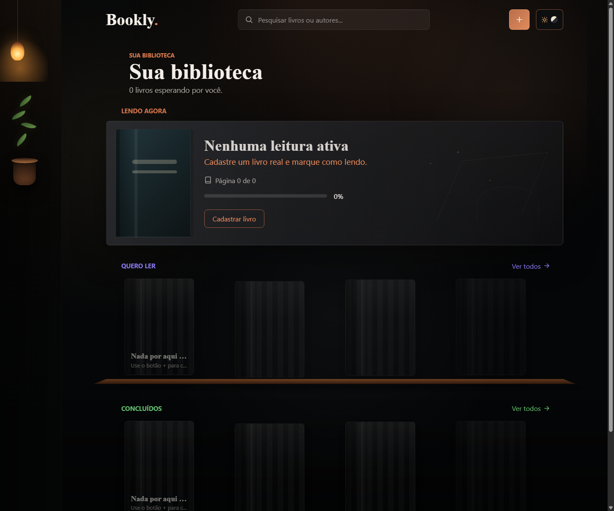
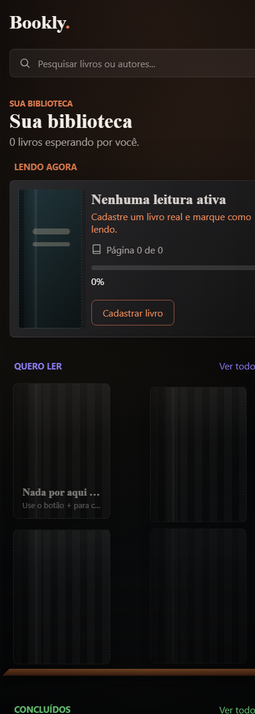

<div align="center">

# 📚 Bookly

### Sua biblioteca pessoal para acompanhar leituras e progresso

Organize livros entre **Quero ler**, **Lendo** e **Concluído**, acompanhe seu progresso e mantenha sua biblioteca pessoal sempre organizada.

<br>

[](https://bookly-five-lyart.vercel.app/)

<br>


</div>

---

## 📖 Sobre o projeto

O **Bookly** é um gerenciador de livros desenvolvido para organizar e acompanhar uma biblioteca pessoal de maneira simples e visual.

A aplicação permite cadastrar livros e classificá-los de acordo com o estágio atual da leitura:

* **Quero ler**
* **Lendo**
* **Concluído**

Cada livro pode conter informações como título, autor, quantidade de páginas, página atual, progresso de leitura, status e avaliação.

O projeto possui uma identidade visual inspirada em uma **biblioteca escura e aconchegante**, buscando fugir da aparência tradicional de dashboards e tornar a experiência mais próxima de uma estante pessoal.

---

## 🌐 Demonstração

A aplicação está disponível online:

👉 **[Acessar Bookly](https://bookly-five-lyart.vercel.app/)**

---

## 📸 Screenshots

### 🖥️ Desktop



---

### 📱 Mobile

<div align="center">



</div>

---

## ✨ Funcionalidades

### ➕ Cadastro de livros

Novos livros podem ser adicionados à biblioteca com informações relevantes para acompanhamento da leitura.

Entre os dados disponíveis estão:

* Título
* Autor
* Número de páginas
* Página atual
* Status de leitura
* Avaliação

---

### 📚 Organização por status

Os livros são separados em três etapas:

```text id="bookly-status"
Quero ler
    │
    ▼
  Lendo
    │
    ▼
Concluído
```

Isso permite visualizar rapidamente quais livros ainda estão na lista, quais estão em andamento e quais já foram finalizados.

---

### 📖 Progresso de leitura

Para livros em andamento, o usuário pode informar a página atual e acompanhar visualmente o progresso.

Exemplo:

```text id="bookly-progress"
O Hobbit
J.R.R. Tolkien

███████░░░ 73%

Página 226 / 310
```

O percentual é calculado a partir da relação entre a página atual e o número total de páginas.

---

### ⭐ Avaliações

Livros concluídos ou em leitura podem receber uma avaliação por estrelas.

Esse recurso permite registrar uma percepção pessoal sobre cada obra diretamente na biblioteca.

---

### 🔎 Busca

A aplicação possui busca para localizar livros utilizando:

* Título
* Autor

Isso facilita a navegação conforme a biblioteca cresce.

---

### 💾 Persistência local

Os dados são armazenados diretamente no navegador utilizando `localStorage`.

Isso permite manter a biblioteca salva mesmo depois de fechar ou atualizar a página.

---

### 📱 Interface responsiva

O Bookly foi desenvolvido para funcionar em diferentes tamanhos de tela.

A interface se adapta para:

* Desktop
* Tablets
* Smartphones

---

## 🛠️ Tecnologias

**HTML5, CSS3, JavaScript Vanilla, Vite, LocalStorage, Vercel**

### Front-end

* HTML5
* CSS3
* JavaScript Vanilla
* Vite

### Persistência

* LocalStorage

### Deploy

* Vercel

---

## 🧠 Como funciona

```text id="bookly-flow"
Usuário
   │
   ▼
Adiciona um livro
   │
   ├── Título
   ├── Autor
   ├── Páginas
   └── Status
   │
   ▼
Biblioteca
   │
   ├── Quero ler
   ├── Lendo
   └── Concluído
        │
        ▼
Atualização do livro
        │
        ├── Página atual
        ├── Progresso
        └── Avaliação
        │
        ▼
LocalStorage
```

---

## 📂 Estrutura do projeto

```text id="bookly-structure"
Bookly/
│
├── screenshots/
│   ├── bookly-desktop.png
│   └── bookly-mobile.png
│
├── favicon.svg
├── index.html
├── script.js
├── styles.css
├── package.json
├── package-lock.json
└── .gitignore
```

---

## 🚀 Como executar localmente

### 1. Clone o repositório

```bash id="bookly-clone"
git clone https://github.com/EmanuelFHX/Bookly.git
```

### 2. Entre na pasta

```bash id="bookly-cd"
cd Bookly
```

### 3. Instale as dependências

```bash id="bookly-install"
npm install
```

### 4. Inicie o servidor de desenvolvimento

```bash id="bookly-dev"
npm run dev
```

Depois, acesse no navegador o endereço exibido pelo Vite.

---

## 📦 Build

Para gerar uma versão de produção:

```bash id="bookly-build"
npm run build
```

---

## 🎯 Objetivo

O objetivo do **Bookly** é oferecer uma forma simples e agradável de acompanhar uma biblioteca pessoal.

A aplicação busca reunir em um único lugar os livros que o usuário deseja ler, está lendo ou já concluiu, oferecendo recursos para acompanhamento de progresso e avaliação sem transformar a experiência em um sistema complexo.

---

## 🎯 Objetivos técnicos

O projeto também permite trabalhar conceitos como:

* JavaScript Vanilla
* Manipulação do DOM
* CRUD no front-end
* Gerenciamento de estado
* Cálculo de progresso
* Filtros e busca
* LocalStorage
* Manipulação de formulários
* Design responsivo
* Vite
* Organização de interfaces

---

## 🚀 Possíveis melhorias

* Capas dos livros
* Integração com API de livros
* Busca automática por ISBN
* Gêneros e tags
* Filtros avançados
* Ordenação por autor ou avaliação
* Datas de início e término da leitura
* Metas de leitura
* Estatísticas mensais e anuais
* Histórico de leitura
* Favoritos
* Importação e exportação da biblioteca
* Autenticação de usuários
* Sincronização entre dispositivos

---

## 📈 Status

O **Bookly** está funcional e disponível online.

O projeto pode continuar evoluindo com novos recursos voltados à organização e acompanhamento de leituras.

---

## 👨‍💻 Autor

**Emanuel Penna**

[](https://www.linkedin.com/in/emanuel-penna)

[](https://github.com/EmanuelFHX)

[](https://portfolio-emanuel-penna.vercel.app/)
